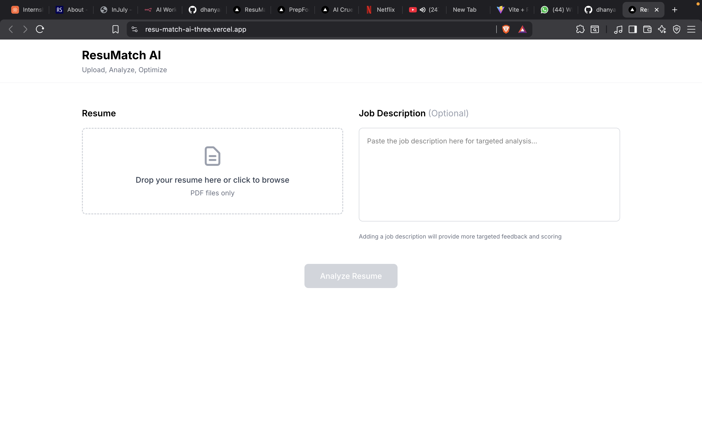
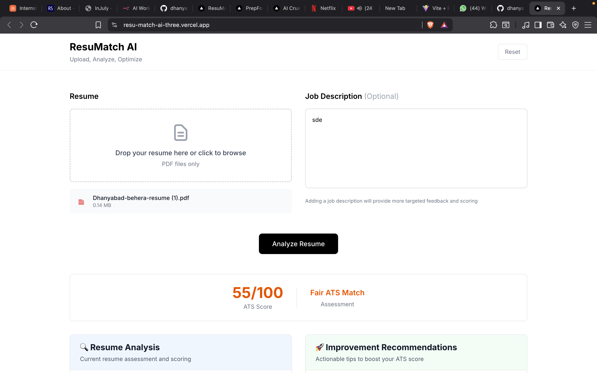
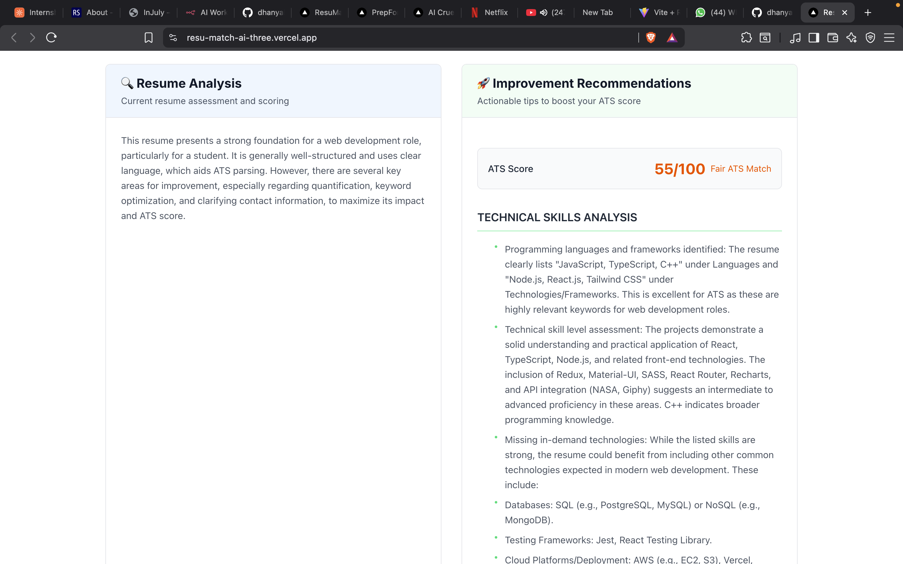
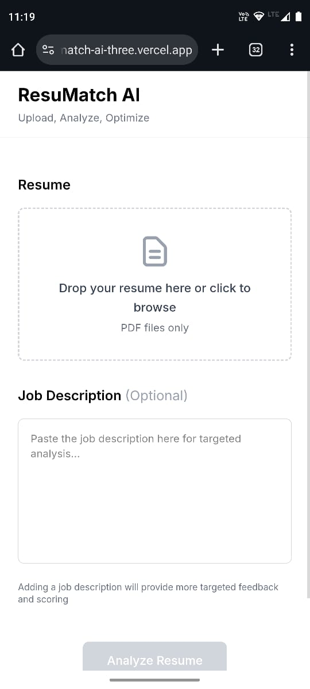

# 🎯 ResuMatch AI

<div align="center">

**AI-Powered Resume Analysis & Optimization Platform**

[](https://resu-match-ai-three.vercel.app/)
[](https://github.com/dhanyabad11/ResuMatch-Ai)
[](LICENSE)

**Live Application**: [https://resu-match-ai-three.vercel.app/](https://resu-match-ai-three.vercel.app/)

</div>

---

## 📖 Overview

**ResuMatch AI** is an intelligent resume analyzer that helps job seekers optimize their resumes using Google Gemini AI. Get comprehensive feedback on resume content, structure, and alignment with job descriptions to beat ATS systems and land your dream job!

---

## ✨ Key Features

### 🤖 AI-Powered Analysis

-   **Google Gemini AI** integration for intelligent resume evaluation
-   Advanced natural language processing for context understanding
-   Industry-specific recommendations

### 📊 Comprehensive Scoring

-   **ATS Compatibility Score** (0-100)
-   **Skills Match Percentage**
-   **Keyword Density Analysis**
-   **Overall Match Score** with job descriptions

### 🎯 Smart Optimization

-   **Missing Keywords Detection** - Find exactly what recruiters are looking for
-   **Section-by-Section Analysis** - Detailed feedback on each resume section
-   **Actionable Recommendations** - Specific improvements you can implement immediately
-   **ATS-Friendly Formatting** - Ensure your resume passes automated screening

### 📄 User-Friendly Interface

-   **Drag & Drop Upload** - Simple PDF resume upload
-   **Real-Time Analysis** - Fast processing with loading indicators
-   **Separated Results** - Clear distinction between analysis and improvement suggestions
-   **Mobile Responsive** - Works perfectly on all devices

### 🔒 Privacy & Security

-   **No Data Storage** - Your resume is processed and discarded
-   **Secure API** - All communications encrypted
-   **API Key Protection** - Environment variables for sensitive data

---

## 🚀 Why ResuMatch AI?

Many qualified candidates get rejected not because they lack skills, but because their resumes don't pass ATS systems or match job description keywords.

**ResuMatch AI solves this by:**

✅ **Beating ATS Systems** - Analyzes formatting and structure for ATS compatibility  
✅ **Keyword Optimization** - Identifies exactly which keywords you're missing  
✅ **Realistic Scoring** - Provides honest assessment of your shortlist chances  
✅ **Actionable Feedback** - Gives specific, implementable suggestions  
✅ **Job-Specific Analysis** - Tailors recommendations to your target role

> 💼 **Success Story**: Users have successfully optimized their resumes and landed offers at major tech companies including FAANG!

---

## 📸 Screenshots

### 🏠 Home Page


_Clean, modern interface for easy resume upload_

### 📊 Resume Analysis


_Comprehensive AI-powered analysis with detailed scoring and feedback_

### 💡 Improvement Recommendations


_Actionable suggestions to optimize your resume for better results_

### 📱 Mobile View

<div align="center">

<br>
<em>Fully responsive design - works perfectly on all devices</em>
</div>

---

## 🛠️ Technology Stack

### Frontend

-   **Framework**: Next.js 15 (React 19)
-   **Language**: TypeScript
-   **Styling**: Tailwind CSS
-   **HTTP Client**: Axios
-   **Deployment**: Vercel

### Backend

-   **Framework**: Flask (Python 3.11)
-   **AI Model**: Google Gemini AI (Gemini-1.5-flash)
-   **PDF Processing**: PyPDF2
-   **CORS**: Flask-CORS
-   **Server**: Gunicorn
-   **Deployment**: DigitalOcean App Platform

### DevOps & Tools

-   **Version Control**: Git & GitHub
-   **CI/CD**: Automatic deployment on push
-   **Monitoring**: DigitalOcean health checks
-   **Environment**: Environment variables for configuration

---

## 📁 Project Structure

```
ResuMatch-Ai/
├── 📂 frontend/                    # Next.js frontend application
│   ├── 📂 src/
│   │   ├── 📂 app/
│   │   │   ├── page.tsx           # Main resume upload & analysis page
│   │   │   ├── layout.tsx         # Root layout with metadata
│   │   │   └── globals.css        # Global Tailwind CSS styles
│   │   └── 📂 lib/
│   │       └── config.ts          # API configuration
│   ├── 📂 public/                  # Static assets
│   ├── package.json               # Frontend dependencies
│   ├── next.config.ts             # Next.js configuration
│   └── tsconfig.json              # TypeScript configuration
│
├── 📂 backend/                     # Flask backend API
│   ├── app.py                     # Main Flask application entry point
│   ├── requirements.txt           # Python dependencies
│   ├── runtime.txt                # Python version specification
│   ├── 📂 src/
│   │   ├── 📂 config/
│   │   │   └── settings.py        # App configuration
│   │   ├── 📂 routes/
│   │   │   └── api_routes.py      # API endpoint definitions
│   │   ├── 📂 services/
│   │   │   ├── ai_service.py      # Google Gemini AI integration
│   │   │   └── pdf_service.py     # PDF text extraction
│   │   ├── 📂 validators/
│   │   │   └── file_validator.py  # File upload validation
│   │   └── 📂 utils/
│   └── .env                       # Environment variables (not in git)
│
├── 📂 .do/                         # DigitalOcean deployment config
│   └── app.yaml                   # App Platform specification
├── 📂 screenshots/                 # Application screenshots
├── DIGITALOCEAN_DEPLOY.md         # DigitalOcean deployment guide
└── README.md                      # This file
```

---

## 🚀 Getting Started

### Prerequisites

Before you begin, ensure you have the following installed:

-   **Node.js** 18+ and npm/yarn
-   **Python** 3.11+
-   **Git** for version control
-   **Google Gemini API Key** ([Get it here](https://makersuite.google.com/app/apikey))

---

## 💻 Local Development Setup

### 🔧 Backend Setup (Flask)

1. **Clone the repository**

    ```bash
    git clone https://github.com/dhanyabad11/ResuMatch-Ai.git
    cd ResuMatch-Ai/backend
    ```

2. **Create Python virtual environment**

    ```bash
    python3 -m venv venv
    source venv/bin/activate  # On Windows: venv\Scripts\activate
    ```

3. **Install dependencies**

    ```bash
    pip install -r requirements.txt
    ```

4. **Set up environment variables**

    Create a `.env` file in the `backend/` directory:

    ```bash
    touch .env
    ```

    Add your configuration:

    ```env
    GEMINI_API_KEY=your_gemini_api_key_here
    FLASK_ENV=development
    PORT=5001
    ```

    > ⚠️ **Security Note**: Never commit `.env` files to version control!

5. **Run the backend server**

    ```bash
    python app.py
    ```

    ✅ Backend will start at: `http://localhost:5001`

---

### 🎨 Frontend Setup (Next.js)

1. **Navigate to frontend directory**

    ```bash
    cd ../frontend
    ```

2. **Install dependencies**

    ```bash
    npm install
    # or
    yarn install
    ```

3. **Configure environment variables**

    Create a `.env.local` file in the `frontend/` directory:

    ```bash
    touch .env.local
    ```

    Add your configuration:

    ```env
    NEXT_PUBLIC_API_URL=http://localhost:5001
    NEXT_PUBLIC_APP_NAME=ResuMatch AI
    NEXT_PUBLIC_APP_DESCRIPTION=AI-powered resume analysis platform
    ```

4. **Run the development server**

    ```bash
    npm run dev
    # or
    yarn dev
    ```

    ✅ Frontend will start at: `http://localhost:3000`

---

## 🌐 Production Deployment

### Deploying to DigitalOcean (Backend)

**Cost**: $5/month (FREE for 40 months with $200 credits!)

1. **Prerequisites**

    - DigitalOcean account with $200 credits
    - GitHub repository connected

2. **Quick Deploy**

    ```bash
    # Push your code to GitHub
    git add .
    git commit -m "Deploy to DigitalOcean"
    git push origin main
    ```

3. **DigitalOcean App Platform Setup**

    - Go to [DigitalOcean App Platform](https://cloud.digitalocean.com/apps)
    - Click **"Create App"**
    - Connect your GitHub repository
    - Select the `backend` directory as source
    - App Platform will auto-detect the configuration from `.do/app.yaml`

4. **Configure Environment Variables** (in DigitalOcean dashboard)

    ```
    GEMINI_API_KEY=your_gemini_api_key_here
    FLASK_ENV=production
    PYTHON_VERSION=3.11.0
    ```

5. **Deploy**
    - Click **"Create Resources"**
    - Wait for deployment (~5 minutes)
    - Your backend will be live at: `https://your-app-name.ondigitalocean.app/`

📖 **Detailed Guide**: See [DIGITALOCEAN_DEPLOY.md](DIGITALOCEAN_DEPLOY.md)

---

### Deploying to Vercel (Frontend)

**Cost**: FREE (Hobby Plan)

1. **Prerequisites**

    - Vercel account (sign up with GitHub)
    - GitHub repository

2. **Quick Deploy**

    [](https://vercel.com/new/clone?repository-url=https://github.com/dhanyabad11/ResuMatch-Ai)

3. **Manual Deployment**

    - Go to [Vercel Dashboard](https://vercel.com/dashboard)
    - Click **"Add New Project"**
    - Import your GitHub repository
    - Framework: **Next.js**
    - Root Directory: `frontend`
    - Environment Variables:
        ```
        NEXT_PUBLIC_API_URL=https://your-backend-url.ondigitalocean.app
        ```
    - Click **"Deploy"**

4. **Configure Custom Domain** (optional)
    - Go to project settings → Domains
    - Add your custom domain
    - Update DNS records as instructed

✅ **Live Demo**: [https://resu-match-ai-three.vercel.app/](https://resu-match-ai-three.vercel.app/)

---

## 📡 API Documentation

### Base URL

```
Production: https://resumatch-ai-backend-4v8rl.ondigitalocean.app
Development: http://localhost:5001
```

### Endpoints

#### 1️⃣ Health Check

**Endpoint**: `GET /health`

**Description**: Check if the API is running and healthy

**Response**:

```json
{
    "status": "healthy",
    "timestamp": "2024-01-20T10:30:00Z",
    "service": "ResuMatch AI Backend"
}
```

**cURL Example**:

```bash
curl https://resumatch-ai-backend-4v8rl.ondigitalocean.app/health
```

---

#### 2️⃣ Analyze Resume

**Endpoint**: `POST /api/analyze`

**Description**: Analyze a resume against a job description using Google Gemini AI

**Request**:

-   **Method**: `POST`
-   **Content-Type**: `multipart/form-data`
-   **Body Parameters**:
    -   `resume` (file, required): PDF file of the resume
    -   `jobDescription` (string, required): Job description text

**Response**:

```json
{
    "success": true,
    "analysis": {
        "ats_score": 85,
        "skills_match": 78,
        "missing_keywords": ["Docker", "Kubernetes", "CI/CD"],
        "overall_feedback": "Your resume shows strong technical skills...",
        "section_feedback": {
            "experience": "Consider adding more quantifiable achievements...",
            "skills": "Include more relevant technical skills...",
            "education": "Well formatted and clear..."
        },
        "recommendations": [
            "Add Docker and Kubernetes experience",
            "Quantify achievements with metrics",
            "Include more action verbs"
        ]
    }
}
```

**Error Response**:

```json
{
    "success": false,
    "error": "Invalid file format. Please upload a PDF file."
}
```

**cURL Example**:

```bash
curl -X POST \
  https://resumatch-ai-backend-4v8rl.ondigitalocean.app/api/analyze \
  -F "resume=@/path/to/resume.pdf" \
  -F "jobDescription=Looking for a Full Stack Developer with React, Node.js..."
```

---

#### 3️⃣ Extract Text from Resume

**Endpoint**: `POST /api/extract-text`

**Description**: Extract plain text from a PDF resume

**Request**:

-   **Method**: `POST`
-   **Content-Type**: `multipart/form-data`
-   **Body Parameters**:
    -   `resume` (file, required): PDF file of the resume

**Response**:

```json
{
    "success": true,
    "text": "John Doe\nSoftware Engineer\nEmail: john@example.com\n\nEXPERIENCE\nSenior Developer at Tech Corp...",
    "page_count": 2,
    "char_count": 3450
}
```

**Error Response**:

```json
{
    "success": false,
    "error": "Failed to extract text from PDF"
}
```

**cURL Example**:

```bash
curl -X POST \
  https://resumatch-ai-backend-4v8rl.ondigitalocean.app/api/extract-text \
  -F "resume=@/path/to/resume.pdf"
```

---

## ⚙️ Configuration

### Backend Environment Variables

Create a `.env` file in the `backend/` directory:

```env
# Required - Google Gemini AI API Key
GEMINI_API_KEY=your_gemini_api_key_here

# Optional - Flask Configuration
FLASK_ENV=development          # development | production
PORT=5001                      # Server port (default: 5001)

# Optional - Python Version (for deployment)
PYTHON_VERSION=3.11.0
```

### Frontend Environment Variables

Create a `.env.local` file in the `frontend/` directory:

```env
# Required - Backend API URL
NEXT_PUBLIC_API_URL=http://localhost:5001              # Local development
# NEXT_PUBLIC_API_URL=https://your-backend.ondigitalocean.app  # Production

# Optional - App Metadata
NEXT_PUBLIC_APP_NAME=ResuMatch AI
NEXT_PUBLIC_APP_DESCRIPTION=AI-powered resume analysis platform
```

### DigitalOcean App Platform Configuration

The `.do/app.yaml` file contains the deployment configuration:

```yaml
name: resumatch-ai-backend
region: sgp1 # Singapore (closest to Bangalore)

services:
    - name: resumatch-ai-backend
      source_dir: /backend
      github:
          branch: main
          deploy_on_push: true
          repo: dhanyabad11/ResuMatch-Ai

      run_command: gunicorn app:app --bind 0.0.0.0:8080 --timeout 120 --workers 2

      envs:
          - key: GEMINI_API_KEY
            scope: RUN_TIME
            type: SECRET
          - key: FLASK_ENV
            value: production
          - key: PYTHON_VERSION
            value: "3.11.0"

      http_port: 8080

      health_check:
          http_path: /health
          initial_delay_seconds: 20
          period_seconds: 10
```

---

## 🏗️ Architecture

### System Flow Diagram

```
┌─────────────────┐         ┌──────────────────┐         ┌─────────────────┐
│                 │         │                  │         │                 │
│  Next.js        │────────▶│  Flask           │────────▶│  Google         │
│  Frontend       │  HTTPS  │  Backend API     │   API   │  Gemini AI      │
│  (Vercel)       │◀────────│  (DigitalOcean)  │◀────────│                 │
│                 │         │                  │         │                 │
└─────────────────┘         └──────────────────┘         └─────────────────┘
      ▲                              │
      │                              │
      │                              ▼
      │                     ┌──────────────────┐
      │                     │                  │
      └─────────────────────│  PyPDF2          │
            Results         │  Text Extractor  │
                            │                  │
                            └──────────────────┘
```

### Component Details

#### Frontend (Next.js)

-   **Pages**: Single page application with drag-and-drop interface
-   **State Management**: React useState hooks
-   **HTTP Client**: Axios with error handling
-   **Styling**: Tailwind CSS for responsive design
-   **Deployment**: Vercel with automatic GitHub deployments

#### Backend (Flask)

-   **Framework**: Flask with Blueprint architecture
-   **CORS**: Flask-CORS with configured origins
-   **AI Service**: Google Gemini AI integration
-   **PDF Processing**: PyPDF2 for text extraction
-   **Server**: Gunicorn with 2 workers
-   **Deployment**: DigitalOcean App Platform

#### AI Processing

-   **Model**: Google Gemini 1.5 Flash (fast and efficient)
-   **Context**: Combines resume text + job description
-   **Analysis**: ATS scoring, keyword matching, feedback generation
-   **Response**: Structured JSON with actionable insights

---

## 🔍 Key Files Explained

### Frontend Files

#### `frontend/src/app/page.tsx`

Main application component with:

-   Drag-and-drop resume upload
-   Job description input
-   Analysis results display
-   Separated sections for analysis and improvements
-   Loading states and error handling

#### `frontend/src/lib/config.ts`

API configuration management:

```typescript
export const API_CONFIG = {
    baseURL: process.env.NEXT_PUBLIC_API_URL || "http://localhost:5001",
    endpoints: {
        analyzeResume: "/api/analyze",
        extractText: "/api/extract-text",
        healthCheck: "/health",
    },
};
```

### Backend Files

#### `backend/app.py`

Flask application factory:

-   CORS configuration for Vercel
-   Blueprint registration
-   Health check endpoint
-   Error handling

#### `backend/src/services/ai_service.py`

Google Gemini AI integration:

-   API key management
-   Prompt engineering for resume analysis
-   Response parsing and structuring
-   Error handling for AI failures

#### `backend/src/services/pdf_service.py`

PDF text extraction:

-   PyPDF2 integration
-   Text cleaning and formatting
-   Multi-page handling
-   Error handling for corrupted PDFs

#### `backend/src/validators/file_validator.py`

File upload validation:

-   PDF format validation
-   File size limits (10MB max)
-   MIME type checking
-   Security validation

---

## 🐛 Troubleshooting

### Common Issues

#### ❌ CORS Errors

**Problem**: "Access-Control-Allow-Origin" error in browser console

**Solution**:

1. Verify backend CORS configuration in `app.py`
2. Ensure frontend URL is in allowed origins
3. Check browser console for exact error
4. For DigitalOcean, verify domain in CORS settings

```python
# backend/app.py
CORS(app, resources={
    r"/api/*": {
        "origins": ["https://resu-match-ai-three.vercel.app"],
        "methods": ["GET", "POST", "OPTIONS"],
        "allow_headers": ["Content-Type"]
    }
})
```

---

#### ❌ 502 Bad Gateway

**Problem**: Backend returns 502 error

**Possible Causes**:

1. Backend server not running
2. Cold start on serverless platform (Render free tier)
3. Backend crashed or out of memory
4. Wrong backend URL in frontend config

**Solution**:

1. Check backend health: `curl https://your-backend-url/health`
2. Check DigitalOcean/Render logs
3. Restart backend service
4. Verify `NEXT_PUBLIC_API_URL` in Vercel environment variables

---

#### ❌ "Failed to analyze resume"

**Problem**: API returns analysis failure

**Possible Causes**:

1. Invalid Gemini API key
2. API quota exceeded
3. Corrupted PDF file
4. Network timeout

**Solution**:

1. Verify `GEMINI_API_KEY` in backend environment
2. Check [Google AI Studio](https://makersuite.google.com/app/apikey) for API status
3. Try with a different PDF file
4. Check backend logs for detailed error

---

#### ❌ PDF Upload Fails

**Problem**: "Invalid file format" error

**Solution**:

1. Ensure file is a valid PDF (not image or DOCX)
2. Check file size < 10MB
3. Try re-saving PDF with different tool
4. Check if PDF is password-protected (not supported)

---

#### ❌ Environment Variables Not Working

**Problem**: Backend can't find API key

**Solution**:

1. **Local Development**: Ensure `.env` file exists in `backend/` directory
2. **DigitalOcean**: Check App Platform → Settings → Environment Variables
3. **Vercel**: Check Project Settings → Environment Variables
4. Restart server after adding environment variables

---

#### ❌ Cold Start Issues (Render Free Tier)

**Problem**: First request takes 30-60 seconds

**Solution**:

-   Migrate to DigitalOcean App Platform (no cold starts)
-   Use Render paid plan ($7/month)
-   Or accept 30-60s delay for first request after 15 min inactivity

---

### Getting Help

If you encounter issues not listed here:

1. Check the [GitHub Issues](https://github.com/dhanyabad11/ResuMatch-Ai/issues)
2. Review backend logs in DigitalOcean/Render dashboard
3. Check browser console for frontend errors
4. Open a new issue with:
    - Error message
    - Steps to reproduce
    - Screenshots/logs
    - Environment details

---

## 🚧 Roadmap & Future Improvements

### 🎯 Planned Features

-   [ ] **Multi-Format Support** - Accept DOCX, TXT, and RTF files
-   [ ] **User Authentication** - Save analysis history with account
-   [ ] **Resume Templates** - Provide ATS-friendly templates
-   [ ] **Export as PDF** - Download analysis report as PDF
-   [ ] **LinkedIn Integration** - Auto-import profile data
-   [ ] **Batch Analysis** - Analyze multiple resumes at once
-   [ ] **Custom Job Boards** - Integration with Indeed, LinkedIn Jobs
-   [ ] **AI Model Selection** - Choose between Gemini, GPT-4, Claude
-   [ ] **Skill Recommendations** - Suggest courses to learn missing skills
-   [ ] **A/B Testing** - Compare two resume versions
-   [ ] **Cover Letter Generator** - AI-powered cover letters
-   [ ] **Interview Prep** - Generate interview questions from resume

### 🔧 Technical Improvements

-   [ ] Redis caching for faster repeat analyses
-   [ ] PostgreSQL database for user data
-   [ ] WebSocket for real-time analysis progress
-   [ ] Docker containerization
-   [ ] Kubernetes deployment
-   [ ] CI/CD pipeline with GitHub Actions
-   [ ] Unit and integration tests
-   [ ] Performance monitoring with Sentry
-   [ ] Rate limiting and API key management
-   [ ] CDN for faster asset delivery

---

## 🤝 Contributing

We welcome contributions from the community! Here's how you can help:

### How to Contribute

1. **Fork the repository**

    ```bash
    git clone https://github.com/dhanyabad11/ResuMatch-Ai.git
    cd ResuMatch-Ai
    ```

2. **Create a feature branch**

    ```bash
    git checkout -b feature/amazing-feature
    ```

3. **Make your changes**

    - Write clean, documented code
    - Follow existing code style
    - Add tests if applicable

4. **Commit your changes**

    ```bash
    git add .
    git commit -m "feat: Add amazing feature"
    ```

5. **Push to your fork**

    ```bash
    git push origin feature/amazing-feature
    ```

6. **Open a Pull Request**
    - Go to the original repository
    - Click "New Pull Request"
    - Describe your changes in detail

### Contribution Guidelines

-   **Code Style**: Follow PEP 8 for Python, ESLint for TypeScript
-   **Commit Messages**: Use conventional commits (feat, fix, docs, etc.)
-   **Documentation**: Update README and code comments
-   **Testing**: Add tests for new features
-   **Issues**: Check existing issues before creating new ones

### Areas We Need Help

-   🎨 UI/UX improvements
-   🧪 Test coverage
-   📖 Documentation
-   🌐 Internationalization (i18n)
-   🐛 Bug fixes
-   ⚡ Performance optimization

---

## 📄 License

This project is licensed under the **MIT License** - see the [LICENSE](LICENSE) file for details.

```
MIT License

Copyright (c) 2024 ResuMatch AI

Permission is hereby granted, free of charge, to any person obtaining a copy
of this software and associated documentation files (the "Software"), to deal
in the Software without restriction, including without limitation the rights
to use, copy, modify, merge, publish, distribute, sublicense, and/or sell
copies of the Software, and to permit persons to whom the Software is
furnished to do so, subject to the following conditions:

The above copyright notice and this permission notice shall be included in all
copies or substantial portions of the Software.

THE SOFTWARE IS PROVIDED "AS IS", WITHOUT WARRANTY OF ANY KIND, EXPRESS OR
IMPLIED, INCLUDING BUT NOT LIMITED TO THE WARRANTIES OF MERCHANTABILITY,
FITNESS FOR A PARTICULAR PURPOSE AND NONINFRINGEMENT. IN NO EVENT SHALL THE
AUTHORS OR COPYRIGHT HOLDERS BE LIABLE FOR ANY CLAIM, DAMAGES OR OTHER
LIABILITY, WHETHER IN AN ACTION OF CONTRACT, TORT OR OTHERWISE, ARISING FROM,
OUT OF OR IN CONNECTION WITH THE SOFTWARE OR THE USE OR OTHER DEALINGS IN THE
SOFTWARE.
```

---

## 🙏 Acknowledgments

-   **Google Gemini AI** - For providing the powerful AI model
-   **Vercel** - For free frontend hosting
-   **DigitalOcean** - For reliable backend hosting with generous credits
-   **Next.js Team** - For the amazing React framework
-   **Flask Community** - For the lightweight Python web framework
-   **Open Source Community** - For inspiration and tools

Special thanks to all job seekers who provided feedback to make this tool better! 💼

---

## 📞 Contact & Support

### Get in Touch

-   **GitHub Issues**: [Report bugs or request features](https://github.com/dhanyabad11/ResuMatch-Ai/issues)
-   **GitHub Discussions**: [Ask questions or share ideas](https://github.com/dhanyabad11/ResuMatch-Ai/discussions)
-   **Email**: [Your Email] (replace with your email)

### Show Your Support

If this project helped you land a job or improve your resume, consider:

-   ⭐ **Star this repository** on GitHub
-   🐦 **Share on Twitter** with #ResuMatchAI
-   💬 **Write a testimonial** in GitHub Discussions
-   🤝 **Contribute** to the project

---

## 📊 Project Stats


---

<div align="center">

**Made with 💼 by developers, for job seekers**

[Report Bug](https://github.com/dhanyabad11/ResuMatch-Ai/issues) · [Request Feature](https://github.com/dhanyabad11/ResuMatch-Ai/issues) · [View Demo](https://resu-match-ai-three.vercel.app/)

</div>

### `POST /extract-text`

Extracts text from a PDF resume without analysis.

**Request:**

-   `resume`: PDF file (multipart/form-data)

**Response:**

```json
{
    "success": true,
    "extracted_text": "Extracted resume text..."
}
```

### `GET /`

Health check endpoint.

## Usage

1. Start both backend and frontend servers
2. Open `http://localhost:3000` in your browser
3. Upload a PDF resume file
4. Optionally paste a job description for targeted analysis
5. Click "Analyze Resume" to get AI-powered feedback

## Getting Google Gemini API Key

1. Visit [Google AI Studio](https://makersuite.google.com/app/apikey)
2. Sign in with your Google account
3. Create a new API key
4. Copy the key to your `.env` file

## Development

### Frontend Development

-   Built with Next.js 14 App Router
-   Uses TypeScript for type safety
-   Styled with Tailwind CSS
-   File upload with drag-and-drop support

### Backend Development

-   Flask REST API with CORS support
-   Error handling and validation
-   PDF processing with PyPDF2
-   Google Gemini AI integration

## Contributing

1. Fork the repository
2. Create a feature branch
3. Make your changes
4. Test thoroughly
5. Submit a pull request

## License

This project is licensed under the MIT License.

## Support

For issues and questions, please open an issue on the GitHub repository.
